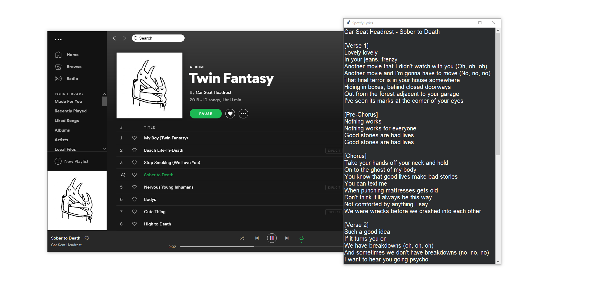

# Spotify-Lyrics

The Spotify Lyrics tkinter app allows users to have the lyrics for the current song they're listening to on Spotify. 



## Requirements 
```
pip install -r requirements.txt
```
In order to use the script, you will need to have an API key for Spotify and Genius. 

## Usage 

To utilize the program, you will have to have a song playing on your Spotify account, which is passed through config. It will automatically refresh the state in order to check for the new song that is potentially being played. 
